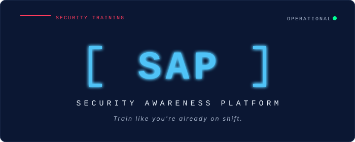
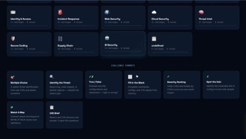

  

# [ SAP ] // Security Awareness Platform 🛡️

A vanilla HTML/CSS/JavaScript security training game that turns the OWASP Top 10, common CVEs, and core analyst concepts into a 250-challenge progression ladder. Pick a module (OWASP, Injection, CVE Brief, Network, Cryptography, Identity & Access, Incident Response, Web Security, Cloud Security, Threat Intel, Secure Coding, Supply Chain, AI Security), answer multiple-choice and written-lab challenges, earn points and trophies, and climb the clearance ranks from **ANALYST** toward **SPECIALIST**. The written-lab grading is done client-side via a hand-built rubric matcher in pure JavaScript &mdash; no external AI API, no upload, no account, no cloud. Built with closure-based factory functions, `textContent` for all user input, and zero dependencies.

This edition wears its **SOC Console** skin &mdash; deep navy paper, neon cyan accents, mono-caps utility labels, bracket-wrapped wordmark, and a circular mission-progress gauge on the right rail. The aesthetic borrows the visual conventions of working security tools (SIEM dashboards, threat intel platforms, bug bounty consoles) because the work the app trains for is the work those tools support. The chrome is the aesthetic of the job.

## 👤 Author
**Jacqueline**
[Check out my GitHub Profile](https://github.com/jdbostonbu-ops)
🚀 **[Try the Live App](https://jdbostonbu-ops.github.io/sap/)**

  

## 🎓 Built During Next Chapter — Phase I

SAP was built on **Day 4 of Phase I Week 2** at Next Chapter Apprenticeship &mdash; a one-day sprint inside the early HTML/CSS/JavaScript curriculum window. Each lesson up to that point fed directly into the build:

- **AI Prompting** — Iterating on the rubric-grading concept with Claude as a thinking partner. Starting from a question ("can I make a written-answer scorer that doesn't need an external AI API?") and arriving at a deterministic concept-matching grader the user can audit by reading the code. Treating the model as a collaborator who had to be redirected when its suggestions drifted toward over-engineering.
- **HTML** — Semantic structure throughout. Module chips as a `role="tablist"` with proper `aria-selected` states, difficulty filters as labeled buttons, the question card as an `<article>` with the four answers as `<button>` elements (not divs with click handlers). The Written Lab modal uses `role="dialog"` and `aria-modal="true"`, with the rubric checklist marked up as an actual checklist screen readers can announce.
- **CSS** — Custom properties drive the entire console theme. Cyan-on-navy palette with a single neon-green for "you got it right" rewards. Sharp 4px corner radius across the entire UI &mdash; not Brutalist 0px but disciplined enough to feel operational, not decorative. The right rail uses CSS Grid; the circular mission-progress gauge is a conic gradient with a masked inner disc; the LIVE INTEL FEED cards have a slow scroll animation respected by `prefers-reduced-motion`.
- **JavaScript** — Closure-based factory functions keep app state private: `createChallengeBank()`, `createScorecard()`, `createRubricGrader()`, `createTrophyBoard()`, `createLeaderboard()`. The rubric grader is the most interesting piece &mdash; it walks an array of concept patterns against the user's typed response, awarding partial credit per concept, and returns a score-plus-grade-letter. No `fetch()` to an LLM, no API key, no network call.
- **Forms** — The written-lab answer textarea demonstrates the week's lesson on form safety. The user's response is read via `.value`, then passed to the rubric grader; if any rubric "feedback" is displayed back, it goes into the DOM via `textContent`, never `innerHTML`. The leaderboard name input goes through the same XSS-safe rendering path.

## 🌐 Browser & Device Compatibility

| Browser / Device | Status | Performance Notes |
| :--- | :--- | :--- |
| **Google Chrome** | ✅ Optimized | Full support &mdash; conic-gradient mission gauge, smooth module-chip transitions, full keyboard navigation across 250 challenges. |
| **Microsoft Edge** | ✅ Optimized | Matches Chrome rendering exactly. |
| **Firefox** | ✅ Supported | Full feature support; conic-gradient and `aria-live` regions all behave identically. |
| **Apple Safari (macOS)** | ✅ Supported | Mission gauge and right-rail dashboard render correctly. |
| **Safari (iOS)** | ✅ Supported | Touch-friendly answer cards, single-tap module switching, Written Lab modal scales correctly on small screens. |
| **iPad / iPadOS** | ✅ Supported | Two-column layout (question canvas left, mission dashboard right) breakpoint engages at 1024px. |
| **Android Chrome** | ✅ Supported | Full mobile compatibility. |

## 🌟 Key Features

- **250 Challenges Across 13 Modules:** OWASP · Injection · CVE Brief · Network · Cryptography · Identity & Access · Incident Response · Web Security · Cloud Security · Threat Intel · Secure Coding · Supply Chain · AI Security. Each challenge is tagged by module, difficulty (Easy / Med / Hard), and question type (Multiple Choice or Written Lab). The module chip row filters the bank live; the difficulty pill row stacks on top of that filter.
- **The Written Challenge Lab (Unlocks After 5 Wins):** A separate modal-based challenge type where the user types a paragraph-length answer to an open-ended security question (e.g., *"Explain SQL injection in plain English. Why does it keep happening? What's the primary control?"*). The rubric grader checks the response against a list of expected concepts &mdash; *Does it explain SQL injection as attackers inserting malicious database commands? Does it mention a real breach or real-world impact? Does it identify parameterized queries as the primary control? Does it address why it keeps happening? Is it written in plain English without unexplained acronyms?* &mdash; awards partial credit (+25 / +15 / +10 per concept), and returns a final score and letter grade (A / B / C / D / F).
- **Rubric-Based Grading Without An AI API:** The "AI-scored" label in the modal subtitle is the game language. The technical implementation is **deterministic concept-pattern matching** &mdash; each rubric item is a set of keyword patterns and synonym variants. The grader walks them against the typed response, scores each concept independently, and the result is reproducible and auditable. **No external LLM call, no API key, no network round-trip, no privacy leak.** Reading the code shows you exactly what's being matched. Bug-free and offline-friendly.
- **Clearance Progression — Analyst to Specialist:** Users start at the **ANALYST** rank. Earning points pushes a progress bar in the right rail; cross the threshold (e.g., 1500 pts) and the rank promotes to **SPECIALIST**. Higher ranks gate higher-difficulty challenges and additional Written Lab content. The promotion path is the long arc of the game.
- **Mission Progress Gauge:** A circular conic-gradient gauge in the right rail tracks solved/total (e.g., 5 / 250) with a cyan progress ring. Updates immediately on every correct answer. Below it, three stat tiles: total **POINTS**, current **STREAK** (consecutive correct), and **TROPHIES** earned.
- **Live Intel Feed:** A right-rail panel that surfaces curated security advisories (modeled on real SANS @RISK newsletter entries and CISA Known Exploited Vulnerabilities catalog format). Each card shows the advisory issue number, the affected products, the date, and the number of related challenges generated from it. **The feed is game flavor &mdash; advisory text and CVE references are illustrative of the real format, used for training narrative, not a live security tool.**
- **Top Banner Ticker:** A deep-red advisory bar across the top of every page surfacing the latest "issue" of `SANS @RISK · Vol.XX No.XX · N new CVE challenges added`. Reinforces the operations-center feel and tells the user fresh content is in the bank.
- **Leaderboard:** Tracks high scores across sessions via localStorage. Player picks a callsign; the leaderboard shows the top scores with rank, callsign, points, and date. Beatable goals, visible competition.
- **Trophy Board (Certs):** Unlockable trophies / certifications for milestones &mdash; *first 10 correct in a row*, *cleared OWASP module*, *cracked Hard difficulty*, *graded an A on a Written Lab*. Trophies persist in localStorage and display on the Certs page like badges on an analyst's wall.
- **Per-Challenge Intel Link:** Each challenge has an INTEL pill that opens a popover with context &mdash; the related advisory, real-world incidents that map to the question, the relevant OWASP entry or CVE identifier. Game mechanic: read the intel, learn the context, answer better.
- **Bracket-Wrapped Wordmark:** The `[ SAP ]` logo treatment in neon cyan mirrors the visual language of professional security tools (Cobalt Strike's bracket aesthetic, Mandiant's mono treatments, bug bounty platform wordmarks). Small move, big tonal signal.
- **Mobile-First Layout:** Single column on phones (mission dashboard moves below the question), two-column at 1024px (canvas + right rail).
- **Accessibility First:** Every animation respects `@media (prefers-reduced-motion)`. Module chips are reachable by keyboard and announce their selection state. The Written Lab textarea is properly labeled. Color is never the only signal &mdash; rubric items have checkbox icons AND green-fill backgrounds AND point values when awarded.
- **Zero Dependencies:** Pure Vanilla HTML5, CSS3, JavaScript ES6+ &mdash; no frameworks, no build tools, no npm. The entire 250-challenge bank loads from a single JSON file at startup.

## 🎨 Theme & Font Choices — SOC Console

SAP's brand is built around one idea: **train like you're already on shift**. The aesthetic borrows from the visual conventions of professional security tools because that's what makes the training feel real. A flashcard app with stock photos would teach the same content; this teaches it with the texture of the work.

### The Navy, Cyan, Status-Green Palette

| Color | Hex | Role |
| :--- | :--- | :--- |
| **Console Paper** | `#0B1733` | Primary background &mdash; deep navy, like a SOC analyst's terminal at 2 AM |
| **Surface 1** | `#11203F` | Card and modal backgrounds |
| **Surface 2** | `#1A2B4D` | Hover states and module-chip backgrounds |
| **Divider** | `#2A3B5E` | Hairline borders on every panel |
| **Ink** | `#E6EEF8` | Primary text |
| **Ink Soft** | `#A8B5CC` | Body and metadata |
| **Muted** | `#6A7891` | Labels, captions, mono small caps |
| **Cyan** | `#4FC3F7` | The action color &mdash; wordmark, active chips, mission gauge ring, NEXT button |
| **Cyan Glow** | `#7DDFFF` | Hover state, glow shadow |
| **Status Green** | `#00FF94` | "Correct answer" + rubric-concept-awarded fill |
| **Alert Red** | `#FF3B5C` | The top advisory banner (SANS @RISK ticker), incorrect-answer feedback |

The palette is restrained where it should be and emphatic where it counts. **Color does specific jobs:** cyan is action and navigation. Green is reward (you got it right). Red is alert (advisory or wrong answer). Ink is content. No gradients in the core UI except the conic-gradient mission gauge, which earns its decorativeness by being a real progress indicator.

### Typography — JetBrains Mono + Inter

| Typeface | Use | Why |
| :--- | :--- | :--- |
| **JetBrains Mono** (400/500/700, UPPERCASE) | Wordmark, utility labels, button text, chip text, all small caps | Monospace gives the operational voice &mdash; every character holds the same width, like the column headers in a SIEM dashboard or a terminal. UPPERCASE everywhere except inside answer text and prose. |
| **Inter** (400/500/700) | Question text, answer text, paragraph prose, Written Lab body | Mixed-case, humanist, readable. **The questions are taught in plain English** even though the chrome talks in mono caps. The lesson is approachable; the frame is professional. |

Two voices for two jobs: mono caps for the brand and operational scaffolding, humanist sans for the actual training content. **The contrast is the brand.** A training tool that talked to its students in monospace caps would feel hostile and unreadable. SAP's voice is operational on the outside, plain-English on the inside.

## 🔒 Privacy & Your Data

SAP was built to teach security awareness, which means it also teaches by example: **the platform itself doesn't collect anything about you.**

- **No account, no signup.** Pick a callsign for the leaderboard if you want; that's the maximum identification. No email, no password, no profile.
- **No server, anywhere.** SAP has no backend. The 250-challenge bank, the rubric definitions, the trophy criteria &mdash; all of it is static JSON shipped with the page. There is no API to call.
- **All progress is local.** Leaderboard entries, trophies, current rank, points, streak &mdash; everything persists via localStorage in your own browser. Clearing your browser data resets your game.
- **The rubric grading is fully client-side.** Your typed Written Lab answers never leave the page. The grader is JavaScript code running in your browser, reading your textarea, scoring against patterns. Open DevTools and you can watch it happen.
- **No telemetry.** SAP doesn't track which questions you got wrong, what time you trained, or which modules you favor. Nobody's building a profile on you. The whole point of a security training tool is that you can trust it.

## 🛠️ Tech Stack

- **Frontend:** Vanilla JavaScript (ES6+) &mdash; closure-based factory functions, `crypto.randomUUID()` for trophy IDs, `requestAnimationFrame` for the streak-flash animation, `textContent` for every user-supplied string (never `innerHTML`)
- **Challenge Bank:** A single JSON file shipped with the page, ~250 entries with module tag, difficulty, type (multiple-choice or written-lab), the question text, the answers, the correct-answer index, the rubric (for written-lab entries), and the optional INTEL link
- **Rubric Grader:** Pure JavaScript pattern matcher. Each rubric item is a `{ concept: string, patterns: RegExp[], points: number }` triple. The grader walks the user's typed response, awards points per matched concept, sums for a final score, and maps score-band to letter grade (A 90+, B 80+, C 70+, D 60+, F below)
- **Storage:** **localStorage** for leaderboard entries, trophy state, current rank, points, streak, and module-progress counters &mdash; namespaced as `sap.*`. No IndexedDB needed; no entry exceeds the localStorage cap.
- **Styling:** CSS3 &mdash; Custom Properties, CSS Grid, Flexbox, restrained 4px corner radius, hairline 1px borders, `conic-gradient()` for the mission progress gauge, layered `box-shadow` for the neon-cyan glow on active chips, `clamp()` fluid wordmark sizing, mobile-first breakpoints at 600px and 1024px, `@media (prefers-reduced-motion)` overrides for every transition
- **Typography:** JetBrains Mono (display + utility caps), Inter (prose and question text) &mdash; Google Fonts CDN
- **Deployment:** GitHub Pages &mdash; zero-config static hosting, automatic HTTPS

## 🚀 The User Flow

- **Land** → SAP opens at Home with the bracket wordmark in the top-left, full nav (Home · Train · Intel Feed · Leaderboard · Certs · Written Lab), the current rank stamp (ANALYST) and stats (points · streak · trophies) in the top-right, and the SANS @RISK advisory banner across the top
- **Pick a module** → tap a chip (OWASP, Injection, CVE Brief, etc.); the question bank filters to just that module
- **Pick a difficulty** → optional filter (All · Easy · Med · Hard) stacks on top of the module filter
- **Answer a multiple-choice question** → tap A, B, C, or D; correct answer flashes status-green, points add to the gauge, streak increments; incorrect answer flashes alert-red and reveals the correct answer with a one-line explanation
- **Earn 5 wins** → the Written Challenge Lab unlocks; a notification confirms it
- **Open the Written Lab** → a modal opens with an open-ended question; type a paragraph-length answer
- **Submit** → the rubric grader runs against your response, awards concept points, displays a checklist of which concepts were caught, shows the final score and letter grade, adds the score to your point total and the leaderboard
- **Climb the ranks** → cross the points threshold to promote from ANALYST to SPECIALIST; higher ranks unlock harder challenges and additional Written Labs
- **Collect trophies** → first-10-in-a-row, cleared-OWASP-module, A-grade-on-a-Written-Lab, etc. View the wall on the Certs page
- **Compete on the leaderboard** → pick a callsign, see how your score ranks against past sessions (all local to your browser)
- **Read the Intel Feed** → browse the simulated security advisories; tap any to see the linked challenges generated from it

## 📋 Architectural Notes — The Rubric Grader

The most interesting piece of SAP is also the simplest: **a vanilla JavaScript grader for written answers that doesn't call an AI.** Here's why that's a real architectural choice, not a cop-out.

The naive approach to grading open-ended answers is to ship the response to an LLM and ask "is this a good answer?" That works, but it introduces:
- An API key in client-side code (or a backend to hide it &mdash; expensive for a one-day sprint)
- Network round-trip latency on every grade
- Variable scoring (the same answer can score differently across runs)
- Privacy concerns (the user's typing is shipped to a third party)
- A failure mode when the API is rate-limited or offline

The rubric approach trades flexibility for transparency:

1. The teacher (Phase I curriculum designer + me) writes the rubric: *"the answer should mention parameterized queries; it should explain SQL injection as attackers inserting commands; it should include a real-world breach example."*
2. For each rubric item, write a small set of regex patterns covering the expected phrasing AND common variants: `/parameterized quer(y|ies)|prepared statements?|stored procedures?/i`
3. The grader walks each rubric item against the user's response. Match = points awarded. No match = no points.
4. Sum the points, map to a letter grade, return the result.

**Reading the rubric tells you exactly what the grader cares about.** A student can study to the rubric not by gaming it but by understanding the concepts the rubric encodes. **The grader becomes a teaching tool.** It also takes <10ms per grade and runs forever offline.

The trade-off: a rubric grader can't catch creative or unexpected-but-correct phrasings. A student who writes a brilliant answer using vocabulary the rubric didn't anticipate will be under-scored. That's a real limitation. The mitigation is to make the rubric patterns broad and include synonym variants &mdash; and to accept that the grader is a teaching tool, not a final judge of student capability.

## 🎓 Future Vision

- **More modules:** Mobile security, social engineering, hardware/firmware, OT/ICS security, privacy law and compliance frameworks
- **Custom rubric builder:** Let trainers add their own Written Lab questions with their own rubrics, save them to localStorage, share them via URL hash
- **Daily challenge:** One curated challenge per day tied to a real CVE advisory from the previous 24 hours
- **Team mode:** Two callsigns competing on the same browser session for whiteboard demo purposes
- **Export progress:** Generate a printable certificate when a rank is promoted, with the user's callsign and which modules they've cleared
- **Spaced repetition:** Track which questions a user gets wrong and re-surface them at increasing intervals (real learning science, retrofit into the game)
- **Open question bank:** Publish the 250-challenge JSON file separately so other security training tools can use it under an open-source license

## 🎓 Background

This project is part of a non-traditional path into software engineering &mdash; 12 years running a full-service insurance agency (systems design, data modeling, risk analysis), 3 years as a Behavior Detection & Analysis Officer with the Department of Homeland Security (real-time anomaly detection, pattern classification), now applied to building accessible, AI-powered web applications. **SAP is the project where the security background sits at the surface.** Behavior detection at DHS is structurally the same work the OWASP Top 10 trains for: looking at an input stream (an airport queue then, a HTTP request now), identifying patterns that don't belong, and intervening before the bad thing happens. The training game is built by someone who's worked on the receiving side of real threats.

⭐ Love this project? Give it a star and explore the other deployed projects in this portfolio.
